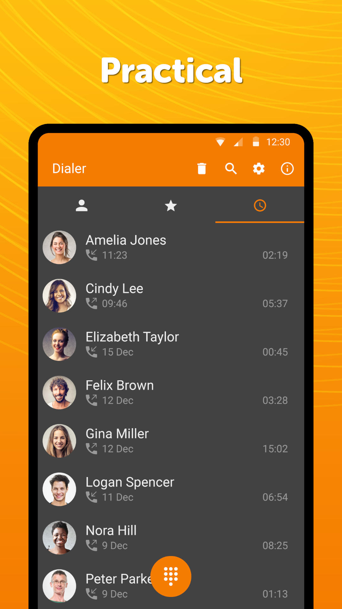
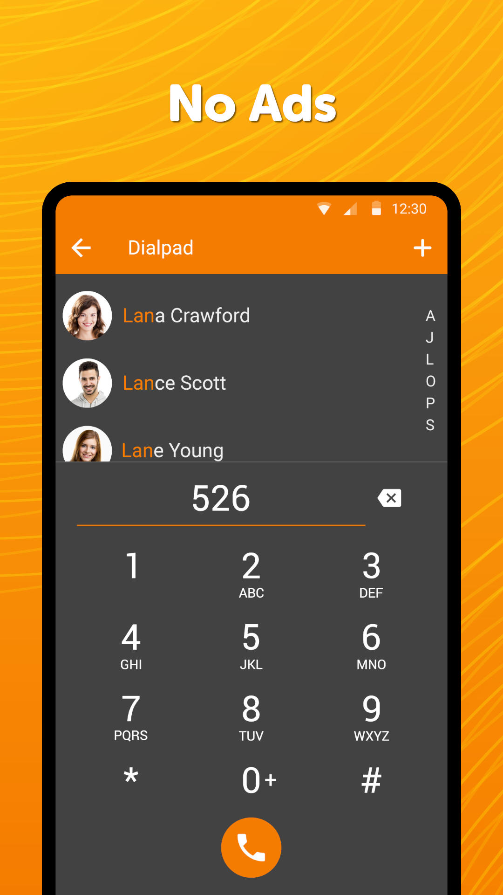
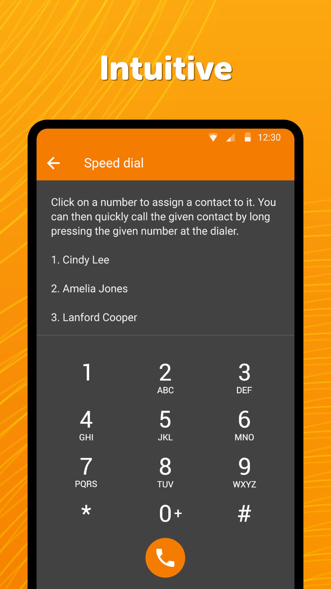

# Simple Dialer

A lightweight app for handling your calls, no matter where are you. Comes with a handy call log for easy call initiation.

There is a quick dialpad at your service too, with smart contact suggestions. It supports letters too.

You can easily block phone numbers to avoid unwanted incoming calls.

Supported Speed dialing makes calling your favorite contacts with this true phone a breeze.

To help you manage your calls quickly the Phone app also supports favorite contacts and creating shortcuts of any contact on the home screen.

It comes with material design and dark theme by default, provides great user experience for easy usage. The lack of internet access gives you more privacy, security and stability than other apps.

Contains no ads or unnecessary permissions. It is fully opensource, provides customizable colors.

Check out the full suite of Simple Tools here:  
https://www.simplemobiletools.com

Facebook:  
https://www.facebook.com/simplemobiletools

Reddit:  
https://www.reddit.com/r/SimpleMobileTools

